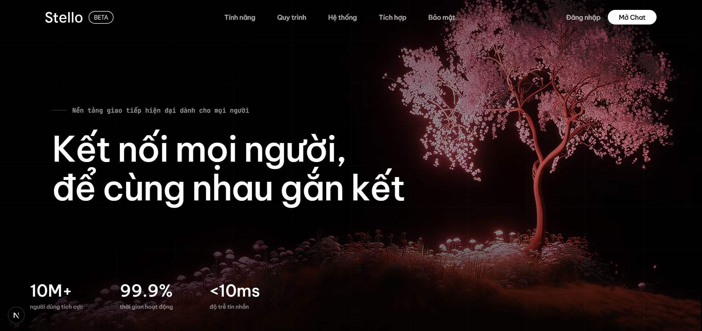
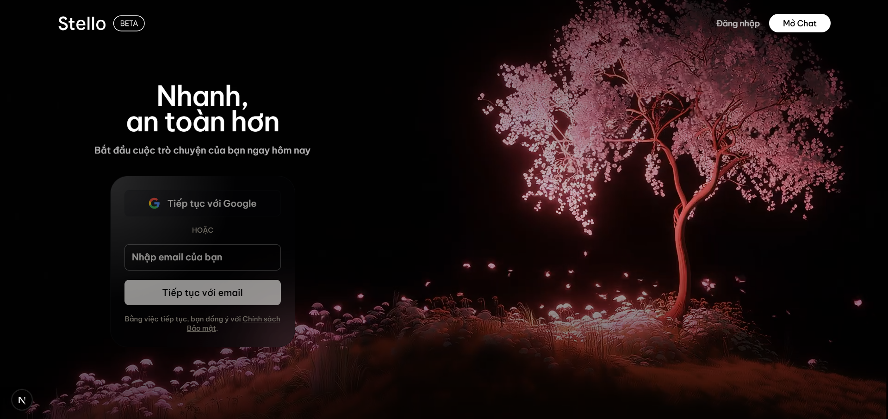
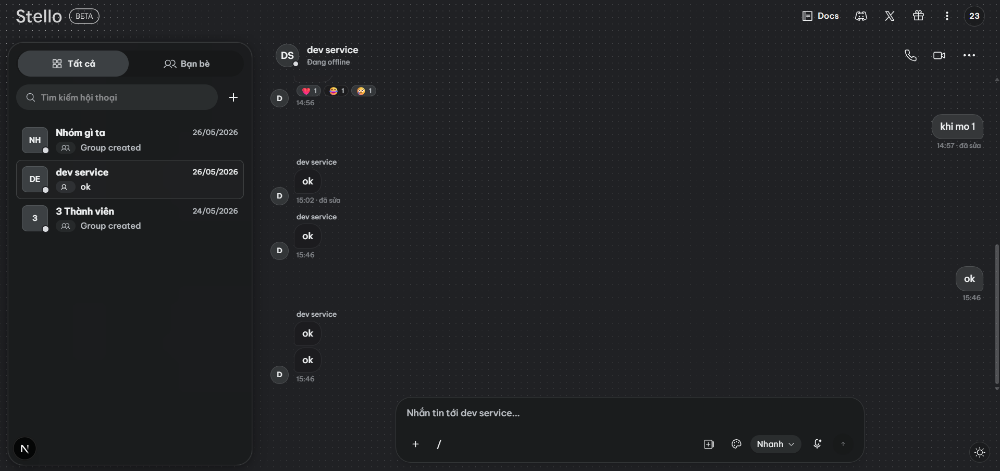
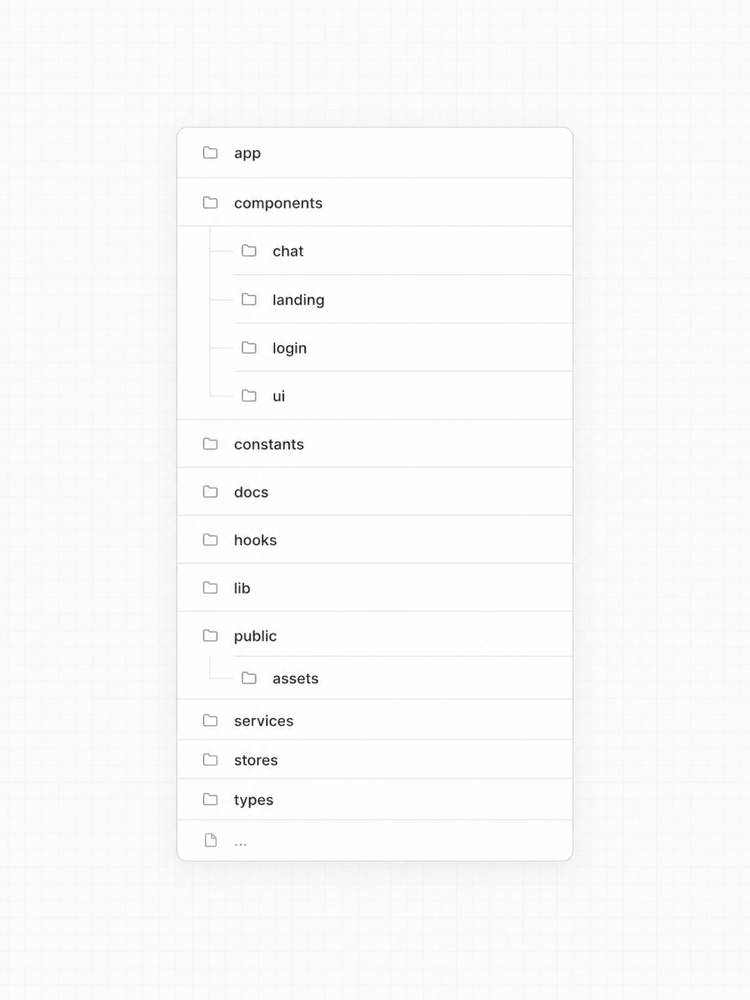

<div align="center">


# Stello

### A modern real-time messaging platform

A production-grade chat client built with **Next.js 16**, **React 19**, **TypeScript**, **Tailwind CSS**, **Zustand**, and **WebSocket** — featuring OTP auth, group conversations, reactions, read receipts, and live updates.

<br/>

[](https://nextjs.org/)
[](https://react.dev/)
[](https://www.typescriptlang.org/)
[](https://tailwindcss.com/)
[](https://zustand-demo.pmnd.rs/)
[](https://pnpm.io/)

</div>

---

## 📸 Screenshots

<div align="center">

| Landing Page | Sign In | Chat |
|:---:|:---:|:---:|
|  |  |  |

</div>

---

## ✨ Features

| Category | Details |
|---|---|
| 🔐 **Authentication** | Email OTP sign-in with persisted session state and middleware-protected routes |
| 💬 **Messaging** | Direct messages and group conversations with full CRUD support |
| 👥 **Contacts** | Contact search, contact requests, and incoming request management |
| ⚡ **Real-time** | WebSocket-powered live updates with reconnect handling |
| 👀 **Presence** | Typing indicators, read receipts, and viewing events |
| 😄 **Reactions** | Emoji reactions on messages |
| 🌗 **Theming** | Light/dark mode via `next-themes` |
| 📱 **Responsive** | Mobile-first layout using Tailwind CSS and Radix UI |

---

## 🛠 Tech Stack

| Layer | Technology |
|---|---|
| **Framework** | [Next.js 16](https://nextjs.org/) — App Router |
| **UI** | [React 19](https://react.dev/), [TypeScript 5](https://www.typescriptlang.org/) |
| **Styling** | [Tailwind CSS 4](https://tailwindcss.com/), [Radix UI](https://www.radix-ui.com/), shadcn-style components |
| **Animations** | [Framer Motion](https://www.framer.com/motion/) |
| **Icons** | [lucide-react](https://lucide.dev/) |
| **State** | [Zustand 5](https://zustand-demo.pmnd.rs/) |
| **Forms** | [React Hook Form](https://react-hook-form.com/) |
| **HTTP** | [Axios](https://axios-http.com/) with typed API envelopes and interceptors |
| **Realtime** | Native WebSocket |
| **Tooling** | pnpm, ESLint |

---

## 📋 Requirements

- **Node.js** 22 or newer
- **pnpm** 9 or newer
- A running backend that implements the API and WebSocket contracts in [`docs/`](./docs/)

---

## 🚀 Getting Started

**1. Clone the repository**

```bash
git clone https://github.com/dinhdev-nu/stello.git
cd stello
```

**2. Install dependencies**

```bash
pnpm install
```

**3. Configure environment** *(optional — only if using a separate backend host)*

```bash
# .env.local
NEXT_PUBLIC_API_BASE_URL=http://localhost:8080/api/v1
```

> If omitted, the app defaults to `/api/v1`.

**4. Start the development server**

```bash
pnpm run dev
```

Open [http://localhost:3000](http://localhost:3000) in your browser. 🎉

---

## 📜 Scripts

| Command | Description |
|---|---|
| `pnpm run dev` | Start the local development server |
| `pnpm run build` | Create an optimized production build |
| `pnpm run start` | Serve the production build |
| `pnpm run lint` | Run ESLint across the project |

---

## 🗂 Project Structure

<div align="center">
  
</div>

---

## 📖 API Documentation

Backend contracts are documented in the [`docs/`](./docs/) folder:

| File | Description |
|---|---|
| [`auth_openapi.md`](./docs/auth_openapi.md) | Authentication endpoints (OTP flow) |
| [`user_openapi.md`](./docs/user_openapi.md) | User and contact management |
| [`room_openapi.md`](./docs/room_openapi.md) | Conversation and group rooms |
| [`message_openapi.md`](./docs/message_openapi.md) | Message CRUD and reactions |
| [`ws_open.md`](./docs/ws_open.md) | WebSocket event contracts |
| [`api.md`](./docs/api.md) | General API conventions |

---

## 🤝 Contributing

Issues and pull requests are welcome once the project is licensed for public collaboration.

When submitting a PR, please:
- Keep changes focused and minimal in scope
- Describe the user-facing impact clearly
- Include screenshots or recordings for any UI changes

---

## 📝 Open Source Checklist

Before the public release, the following files should be added:

- [ ] `LICENSE`
- [ ] `CONTRIBUTING.md`
- [ ] `SECURITY.md`
- [ ] `.env.example`

---

<div align="center">

Made with ❤️ by [dinhdev-nu](https://github.com/dinhdev-nu)

</div>